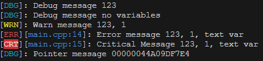

# CTC Logger

This is my personal simple logger implementation, specifically to use along with my graphics programming 
and cpp journey.

## Usage

There are macros defined that output the message to the console if NDEBUG is not defined on the build.

Copy the include/ctc folder and include on your project.

``` cpp
#include <ctc/logger.hpp>

int var0 = 123;
double var1 = 1.0;
std::string var2 = "text var";

// Just output the message to the console
LOGGER_DEBUG("Debug message {0}", var0);
LOGGER_WARN("Warn message {0}, {1}", var0, var1);

// Output file and line and the message
LOGGER_ERROR("Error message {0}, {1}, {2}", var0, var1, var2);
LOGGER_CRITICAL("Critical Message {}, {}, {}", var0, var1, var2);

// Output the variable address
LOGGER_DEBUG("Pointer message {}", &var0);

// Terminates the program if condition is true
ASSERT(true, "Assertation failed");
ASSERT(false, "Assertation does not failed");
ASSERT(true, "Assertation failed {}", "123");

// Direct usage
ctc::logger.debug("Direct usage");
```

Output example

